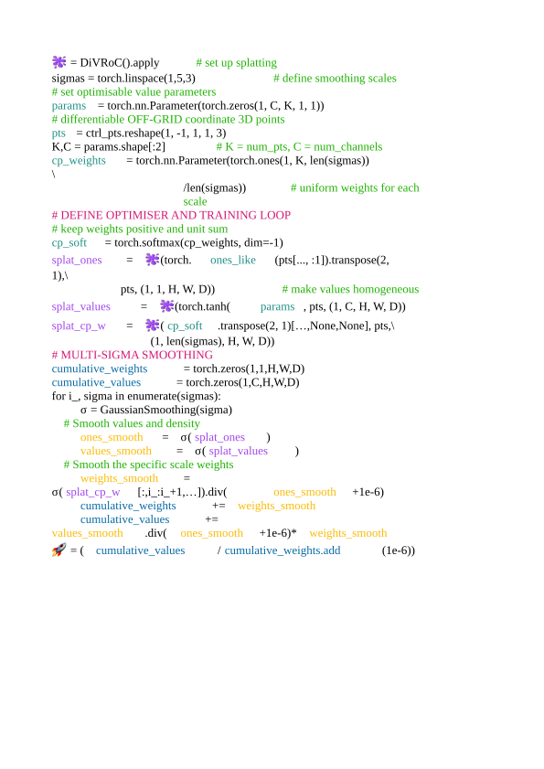
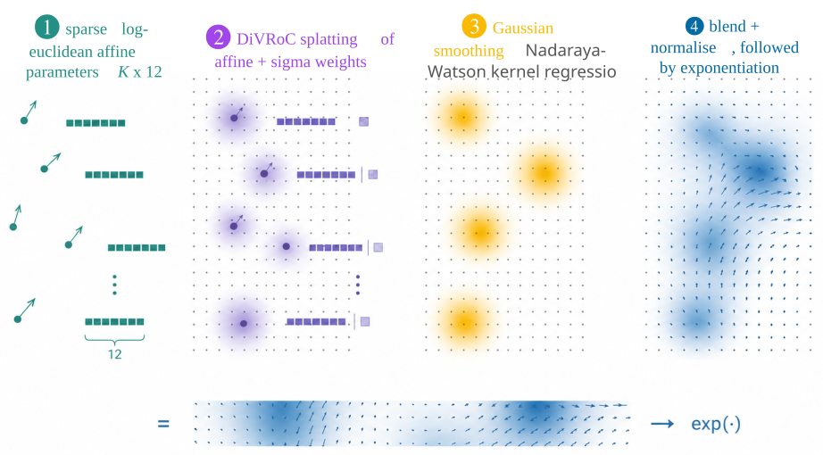

# overparam_reg
code for Off-Grid 2026 paper on deformable 3D registration 

# Multi-Scale Differentiable Gaussian Splatting for Sparse 3D Registration

This repository provides an implementation of over-parameterized multi-scale rasterization for sparse spatial representations. By blending sparse control points with multi-scale Gaussian kernels, this approach provides efficient, flexible, and topology-preserving transformations for 3D medical image registration.

---

## Technical Overview

### Motivation
Standard dense volumetric representations for 3D scans present several key challenges:
* **Privacy & Security:** High risk of patient re-identification.
* **Computational Overhead:** Inefficient processing on edge or low-power devices.
* **Transform Composition:** Suboptimal for concatenating multiple spatial transforms during registration.

While sparse off-grid representations improve computational efficiency, managing complex spatial interactions remains challenging. This project bridges that gap by introducing **over-parameterized multi-scale rasterization for sparse data**.

---

### Core Methodology

#### 1. Implicit Neural Representations (INRs) & SIRENs
Standard implicit models (e.g., SIRENs) learn periodic functions that map coordinates (grid or sparse) to continuous scalar or vector fields (such as grayscale intensities or displacement fields). They encode signal phase, magnitude, and frequency directly within network weights.

#### 2. Multi-Scale Differentiable Gaussian Splatting
We reframe continuous spatial representations by defining signals via:
* An optimizable set of **sparse control points**.
* A **multi-scale softmax mixture of weighted Gaussian blobs** splatted onto a regular grid.

By analyzing the Jacobian operation of the standard `grid_sample` operator, we achieve efficient trilinear rasterization that scatters contributions from sparse points to their 8 immediate 3D neighboring grid nodes—without requiring customized CUDA kernels.

Extending this to **multiple parallel scales** enables local weighting across predefined Gaussian kernels:
* **High-Frequency Regions:** Driven by higher weights on smaller $\sigma$ values.
* **Homogeneous Regions:** Driven by larger $\sigma$ values.
* **Spatially Varying Smoothness:** Blending multi-scale parameters enables grid-based convolutions to handle non-uniform spatial smoothness across complex deformation fields.

#### 3. Log-Euclidean Local Transforms (3 to 12 Degrees of Freedom)
To capture complex localized motion, we expand the per-control-point degrees of freedom (DoF) from 3 (pure translation) to 12 (affine: local rotation, scaling, and shear):
* Local matrices are parameterized in **Log-Euclidean vector space** (linear vector space) and exponentiated to maintain smooth, invertible transforms.
* Blending these parameters generates expressive, topology-preserving deformation fields.

---

### Key Experimental Results

Evaluated on **abdominal inter-subject registration (AMOS)** using Dice overlap across 9 organs, and **lung expiration/inspiration registration (COPDGene)** using target registration error (TRE) on manual landmarks with symmetric mid-transforms:

* **Explicit Models (Adam Optimizer):**
  * **+2.5% Dice improvement** on AMOS by adopting Log-Euclidean 12-DoF parameterization over standard translations.
  * **~50% TRE reduction** on COPDGene driven by multi-sigma Gaussian splatting.
* **Implicit Neural Fields (SIREN):**
  * Provides consistent baseline performance as the neural field implicitly captures these spatial characteristics.

---

### Key Takeaways & Future Directions
* **Accelerated Convergence:** Lifting the optimization landscape with sparse points avoids local minima and speeds up convergence, even when representing volumes with only a few thousand points.
* **Hybrid Efficiency:** Differentiable rasterization provides the efficiency of sparse points combined with the spatially varying smoothness of grid convolutions.
* **Future Work:** Automatically learning keypoint extraction and adapting spatially varying smoothness directly from training data.
